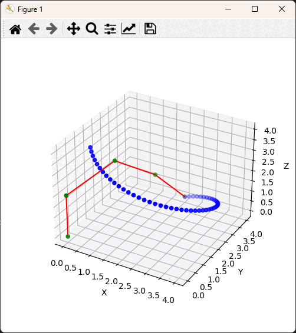

# InverseKinematicsANN
Inverse kinematics for 6DOF planar robot achieved with FABRIK algorithm and Artifical Neural Network. User is able to choose which one to use.

## Description
Project is written purely in Python.

There are two main user/programmer interfaces. 

1. CLI that allows to generate .csv file with trajectory coordinates and provide a convenient way to generate inverse kinamtics for robot and visualize output.

2. Scalable RPC server based on RabbitMQ message broker. User can run many brokers and split large datasets between them to obtain more efficient calculations and shorter response time.

## How to use it
### CLI
First CLI operation is generating robot effector trajectory.

> usage: cli [-h] --generate-data --shape {circle,cube,cube_random,random,spring,random_dist} [--verbose] [--example] [--to-file TO_FILE]

**--shape** is mandatory parameter to choose from available trajectory shapes,

**--example** show an example for chosen shape,

**--to-file** redirect output of inverse kinematics to .csv file, command argument is filename,

**--verbose** if set return calculated angles to output then plot scatter.

Spring shape example:

> cli --generate-data --shape spring --samples 50 --dim 2,3,6

Second available CLI operation is robotic arm inverse kinematics calculation. Joints angles are returned in the same order as coresponding effector destination. Inverse kinematics method must be set explicitly, **ann** or **fabrik**.

> usage: cli [-h] --inverse-kine --method {ann,fabrik} [--list-models] --points POINTS [--to-file TO_FILE] [--verbose] [--show-path] [--separate-plots]

**--method** set inverse kinematics algorithm engine, **ann** or **fabrik**,

**--model** mandatory parameter, argument value is pretrained neural net .h5 file model name, settable only if **ann** IK method was choosed, all available models in repository are in **models** directory,

**--list-models** list all models available inside defualt **models** directory,

**--separate-plots** is used to separately plot input trajcetory and trajectory based on predicted angles,

**--verbose** and **--to-file** parameters work here as well.

Example for IK calculated via ann:

> cli --inverse-kine --method ann --model models/roboarm_model_1674153800-982793.h5 --points spring.csv --verbose

same operation for **fabrik**:

> cli --inverse-kine --method fabrik --points spring.csv --verbose

### RPC broker
RPC broker run on default RabbitMQ addres localhost:5672. Broker has single queue named 'ikine_queue'. Example client can be found in examples directory (examples/rpc_client.py). To start inverse kinematics broker first RabbitMQ must be installed and service started.

Running broker is simple:

> python rpc_broker.py

If at least one instance of broker is running example client can be used:

> python examples/rpc_client.py

Command output will show example usage.

## Demonstration

Robot IK for trajectory below was calculated with ANN model 'roboarm_model_1674153800-982793.h5'. That model is available in **models** directory in repository. Trajectory was generated via CLI command for 'spring' shape.

## TODOs
1. Support for custom planar robots.
2. Interface to train ANN model for custom robots.
3. Add remote RPC.
